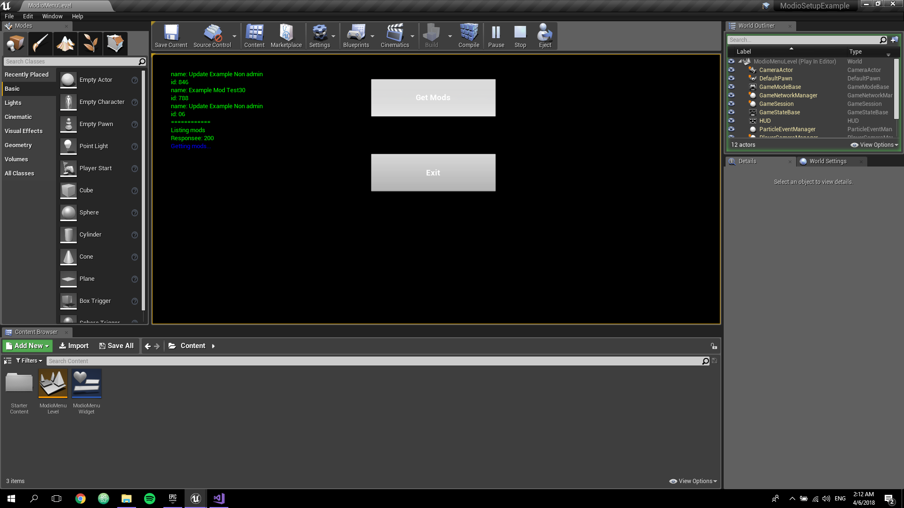
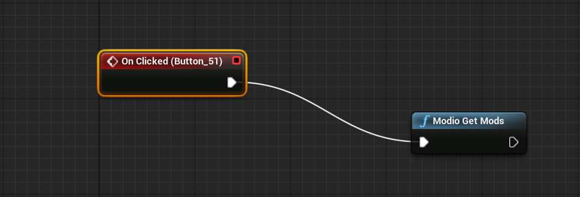
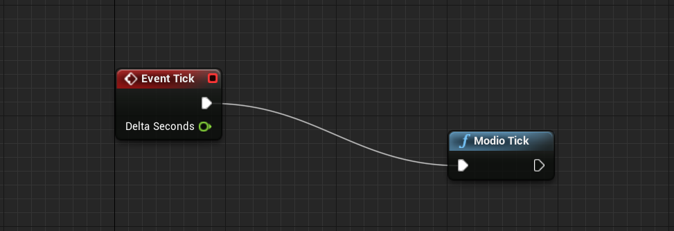

# ModioSDKUE4Setup

In this tutorial we are going to cover how to install and use the mod.io SDK functionality in your UE4 project.

# Step 1: Load the mod.io SDK

1. Create a [ThirdParty/modio Directory](ThirdParty/modio) and create a `Includes` and `Libraries` directory inside it.
2. Download the mod.io SDK, extract it.
3. Locate the files provided by the mod.io SDK and place them on your UE4 project accordingly:
  * Locate the `include` folder, create a directory named `ThirdParty/modio/Includes/` and place it contents there.
  * Locate the `modio.lib` file under the `NMake` libraries folder, create a directory named `ThirdParty/modio/Libraries/` and place it there.
  * Locate the `modio.dll` file under the `NMake` binaries folder, create a directory named `Plugins/modio` and place it there.
4. Edit your Project's [Build.cs](Source/ModioSetupExample/ModioSetupExample.Build.cs) accordingly to load the library.

# Step 2: Initialize the mod.io instance

1. Import and create a mod.io instance pointer on your [Game Module Header](Source/ModioSetupExample/ModioSetupExample.h#L8)
2. Initialize and shutdown the mod.io instance on your [Game Module Source](Source/ModioSetupExample/ModioSetupExample.cpp)

# Step 3: Use mod.io from your blueprints

1. Create a UE4 Blueprint Library. 
1. Define all the methods in your [Modio Blueprint Library Header](Source/ModioSetupExample/ModioBlueprintFunctionLibrary.h).
2. Implement them on your [Modio Blueprint Library Source](Source/ModioSetupExample/ModioBlueprintFunctionLibrary.cpp).
3. You can now use the methods from your blueprints:

